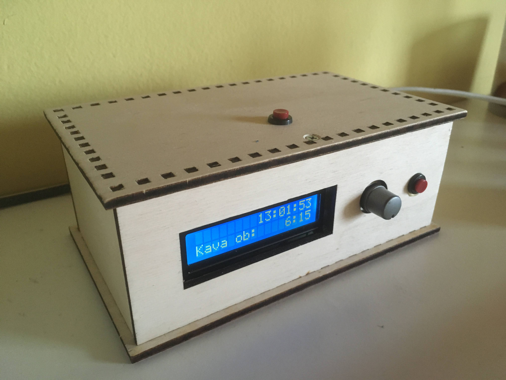
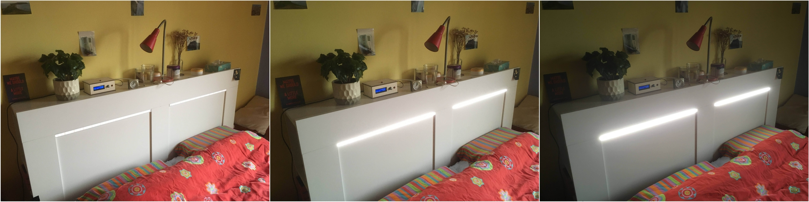
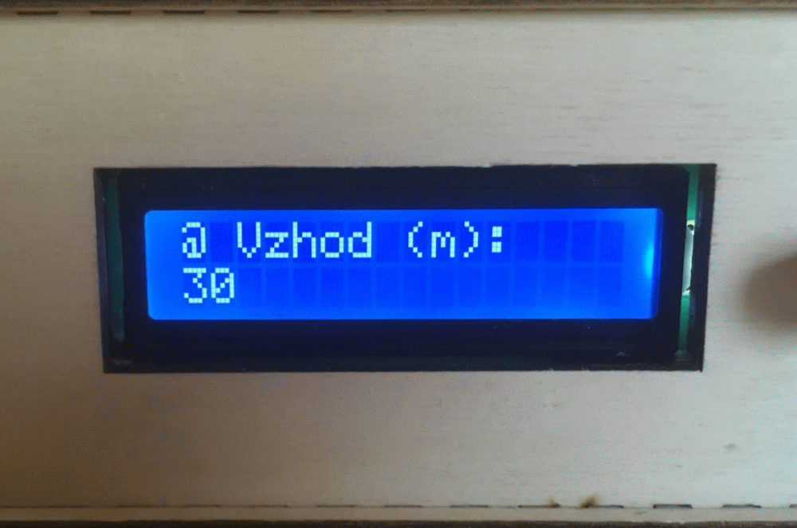

# SunAlarm
SunAlarm is a simple alarm clock that simulates sunrise so all of us narcoleptics can somehow get out of the bed.  
And, yeah, it is nothing new - you can buy that at Amazon for 50$ and it will also play you a music at wake-up time. This project is for those who have some spare STM32 dev boards and other electronic material (like I do) and/or want to have some customization (like special light source, settable light intensity, nigh-lamp, ...).

  
  

In english this would correspond to settings: 
* Sunrise time (time that light intensity is gradually increased).
* Value of maximum intensity (in percent).
* Night light intensity (light of constant intensity, powered on/off by user).
* Automatic shutdown time (after wake up time is reached).
* Time settings (h, m). 

"Kava ob" is wake up time, translated to: "Coffee at". At that (wake up) time, light intensity has reached its
user defined max intensity.  
These strings can be easily translated, see *user\display_ctrl.c*.

Currently 12V LED strip is controlled via MOSFET, but any kind of light source can be used, depending on your HW.  
HW is not described in details here, but required pins and configuration can be seen from CubeMX project or source files directly.

## UI
Setup button:
* Single press: toggle alarm on/off; Rot. encoder: changes alarm time
* Long press: enter/exit setup menu; Rot. encoder: changes current setup value

Light button:
* Single press: toggle night light on/off; Rot. encoder: / OR changes alarm time if alarm is enabled
* Holding button and rotating rot. encoder: changes current intensity value, if light is enabled

## Issues
No external crystal and therefore time drift - the PCB I have is some custom motor driver which has been reused for this purpose.  
Real solution should include external oscillator which could be further trimmed via FW.